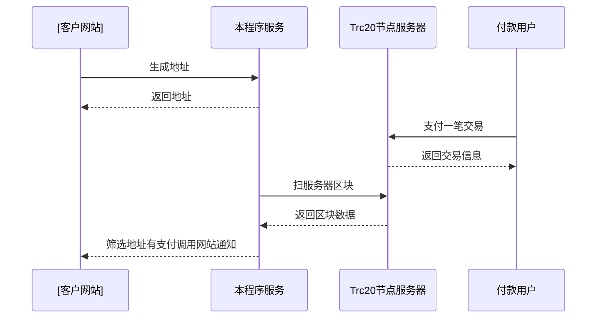

### 测试

### 程序基础业务流程

```mermaid
sequenceDiagram
participant B as [客户网站]
participant M as 本程序服务
participant D as Trc20节点服务器
participant S as 付款用户

B->>M: 生成地址
M-->>B: 返回地址

# 转账交易


S->>D:  支付一笔交易
D-->>S: 返回交易信息

M->>D: 扫服务器区块
D-->>M: 返回区块数据

M-->>B: 筛选地址有支付调用网站通知
#B-)D: 请你出去

```
